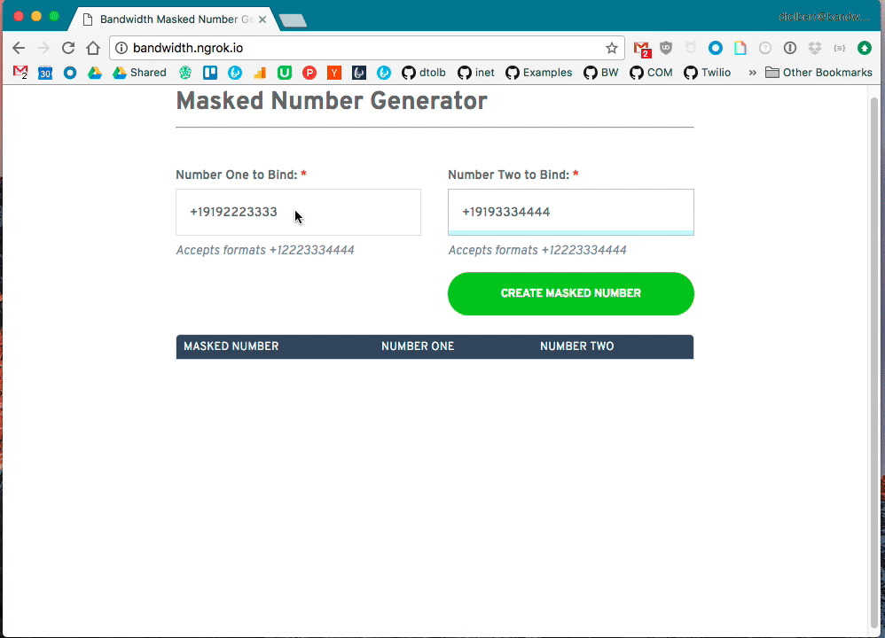
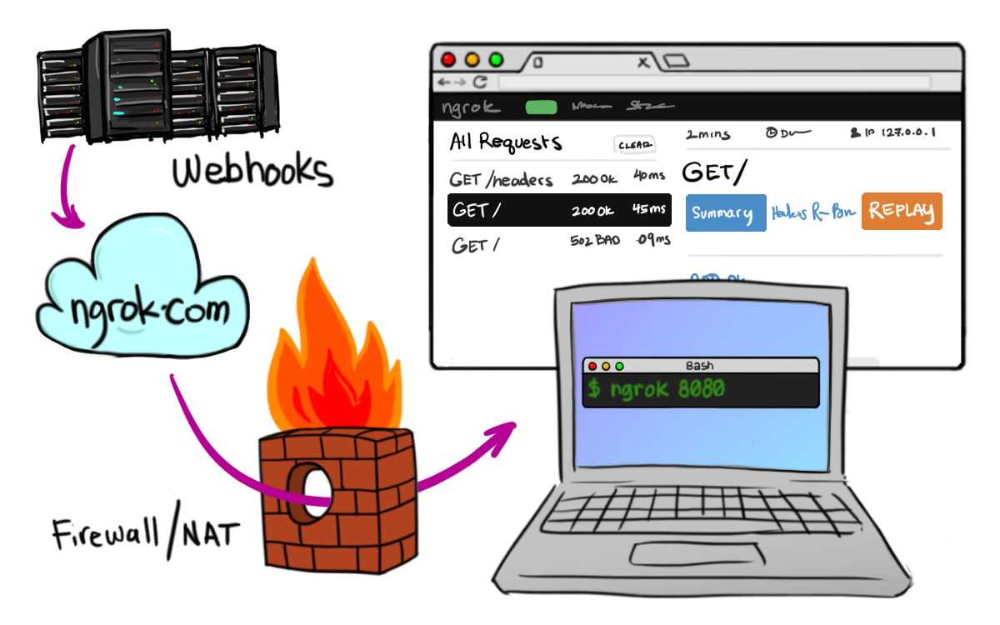
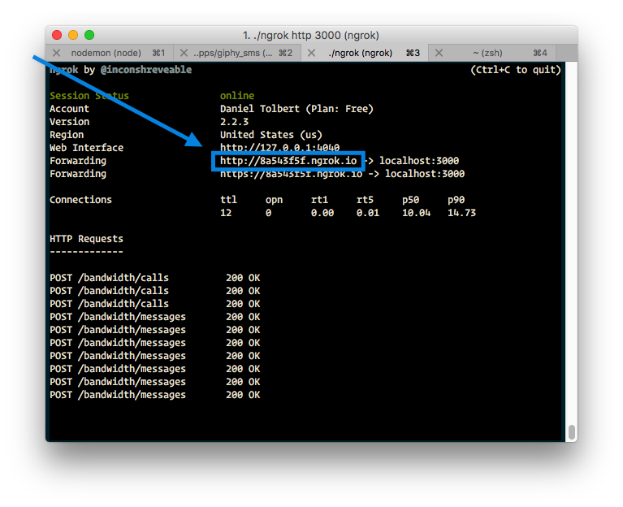
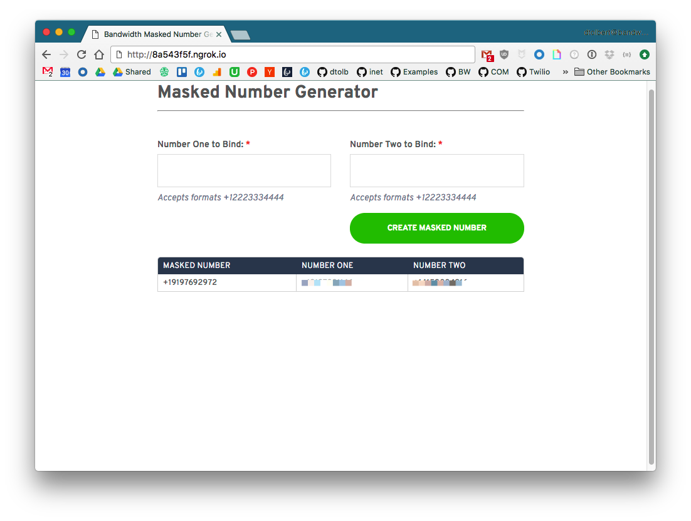
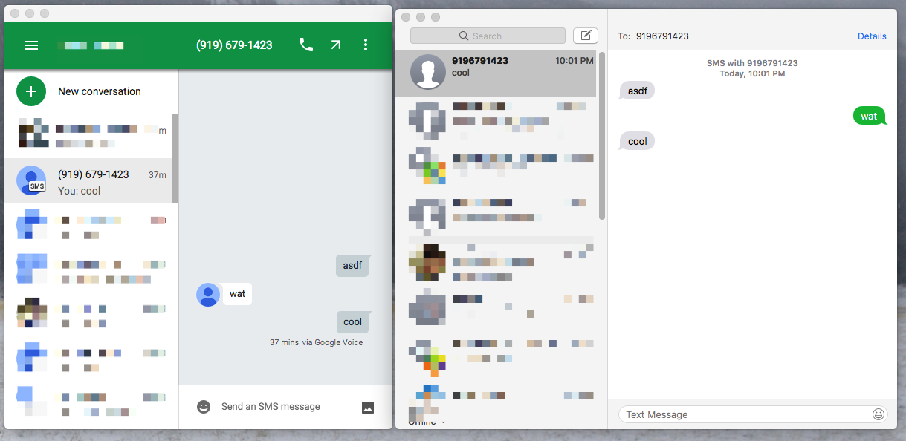

<div align="center">

# Bandwidth Masked Number API


</div>

Stupid simple masked numbers

[](https://heroku.com/deploy)

## Table of Contents

* [Bandwidth](http://dev.bandwidth.com)
* [PreReqs](#prereqs)
* [How it works](#how-it-works)
 * [Diagram](#call-the-maskednumber-from-either-one-of-the-two-numbers)
* [Create your first binding](#create-your-first-binding)

## PreReqs

* [Node v7.8.0+](https://github.com/nodejs/node/blob/master/doc/changelogs/CHANGELOG_V7.md#7.8.0)
* [Bandwidth Account](http://dev.bandwidth.com)
* [Heroku Account](https://www.heroku.com/)
* `BANDWIDTH_USER_ID` - Saved to environment variable
* `BANDWIDTH_API_TOKEN` - Saved to environment variable
* `BANDWIDTH_API_SECRET` - Saved to environment variable
* `DATABASE_URL` - Saved to enviroment variable

## Local Deployment
* [ngrok](https://ngrok.com/) Installed with account
* [Postgres](http://postgresapp.com/documentation/install.html)
* [Setup Ngrok](#hosting-with-ngrok)
* [Run Application](#installing-and-running)

## How it works
Creates a 'number in the middle' for a set of two numbers.

I.E. You want to create a masked number for an ondemand cat delivery service.  That way the customer and the cat delivery driver can communicate safely and privately.  It also can give you insight into what type of questions happen between the cat orderer and delivery driver.  This would create a service so that a there is a shared number.

For each *pair* of cat orderers and deliverers there is a number. A customer ordering multiple cats would get a new number for each cat delivery driver.

A cat delivery driver can also order an on demand cat.



### Create a binding

To create a number between two numbers, create a `POST` request to the service:

```http
POST /v1/bindings

{
	"numbers": ["+19192223333", "+19194445555"]
}

201 Created
{
	"maskedNumber": "+19197778888",
	"numbers": ["+19192223333", "+19194445555"]
}
```

The number that binds the two numbers is returned in the response body as the `maskedNumber`

### View current bindings

```http
GET /v1/bindings

[
	{
		maskedNumber: "+19197779999",
		numberOne: "+19192224444",
		numberTwo: "+19192223333",
		createdAt: "2017-04-06T19:37:23.106Z",
		updateAt: "2017-04-06T19:37:23.106Z"
	},
	{
		maskedNumber: "+19197776666",
		numberOne: "+19192222222",
		numberTwo: "+19192227777",
		createdAt: "2017-04-06T19:37:23.106Z",
		updateAt: "2017-04-06T19:37:23.106Z"
	},
	{
		"...":"..."
	}
]
```

### Call the 'maskedNumber' from either one of the two numbers


## Hosting with ngrok

[Ngrok](https://ngrok.com) is an awesome tool that lets you open up local ports to the internet.



Once you have ngrok installed, open a new terminal tab and navigate to it's location on the file system and run:

```bash
$ cd ~/Downloads/
$ ./ngrok http 3000
```

You'll see the terminal show you information



Copy the `http://8a543f5f.ngrok.io` link and paste it into your browser.

> On first run, the application will create the Bandwidth callbacks and voice/messaging application for you.  Be sure you visit the `ngrok` url and not `localhost`. Bandwidth needs to be able to send callbacks.



## Installing and running

Once [ngrok](#hosting-with-ngrok) is up and running. Open a new tab and clone the repo:

```bash
git clone https://github.com/dtolb/masked-number-api.git
```

Then change into the directory and install [`nodemon`](https://www.npmjs.com/package/nodemon).  `nodemon` watches for changes in the local directory and auto restarts the app.

```bash
cd masked-number-api
```

### Install node modules

```bash
npm install
```

### Run the app

```bash
npm run debug
```

### Open the app using the `ngrok` url

When the app runs for the first time, it setups the Bandwidth voice and messaging callbacks for the application for you.  It sets the callback urls based on the url visited!

### Create your first binding with a `POST` request
Now you can create a request to bind two numbers:

```http
POST localhost:3000/v1/bindings

{
	"numbers": ["+19192349874", "+19192349876"]
}

201 created

{
	"maskedNumber": "+19195554444",
	"numbers": ["+19192349874", "+19192349876"]
}
```

Call or text the number `+19195554444` number from either `numbers`: `+19192349874`, `+19192349876` and the other number will ring or get a message `from` the `maskedNumber`



