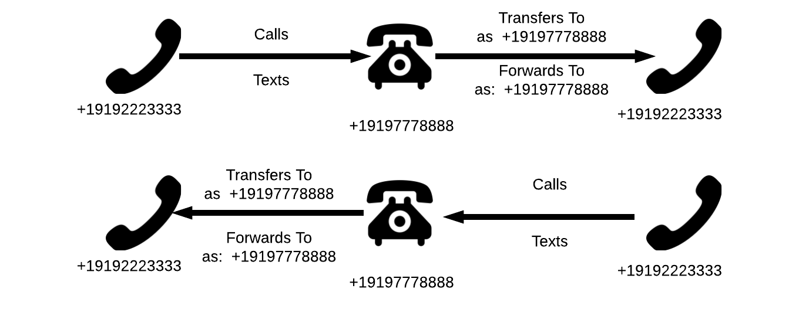

# masked-number-api
Stupid simple masked numbers

## Table of Contents

* [Bandwidth](http://dev.bandwidth.com)
* [PreReqs](#prereqs)
* [Todos](#todos)
* [How it works](#how-it-works)
 * [Diagram](#call-the-maskednumber-from-either-one-of-the-two-numbers)
* [Setup Bandwidth application](#setup-bandwidth-application)
* [Setup Ngrok](#hosting-with-ngrok)
* [Run Application](#installing-and-running)
* [Create your first binding](#create-your-first-binding)

## PreReqs

* [Node v7.8.0+](https://github.com/nodejs/node/blob/master/doc/changelogs/CHANGELOG_V7.md#7.8.0)
* [Bandwidth Account](http://dev.bandwidth.com)
* [Bandwidth Application](#setup-bandwidth-application)
* [ngrok](https://ngrok.com/) Installed with account
* `BANDWIDTH_USER_ID` - Saved to environment variable
* `BANDWIDTH_API_TOKEN` - Saved to environment variable
* `BANDWIDTH_API_SECRET` - Saved to environment variable
* `BANDWIDTH_APPLICATION_ID` - Saved to enviroment variable

## todos

* Add real database connection, right now it just stores in memory
* Add simple UI to make post request to view and add associations

## How it works
Creates a 'number in the middle' for a set of two numbers.

I.E. You want to create a masked number for an ondemand cat delivery service.  That way the customer and the cat delivery driver can communicate safely and privately.  It also can give you insight into what type of questions happen between the cat orderer and delivery driver.  This would create a service so that a there is a shared number.

For each *pair* of cat orderers and deliverers there is a number. A customer ordering multiple cats would get a new number for each cat delivery driver.

A cat delivery driver can also order an on demand cat.

### Create a binding

To create a number between two numbers, create a `POST` request to the service:

```http
POST /v1/bindings

{
	"numbers": ["+19192223333", "+19194445555"]
}

201 Created
{
	"maskedNumber": "+19197778888",
	"numbers": ["+19192223333", "+19194445555"]
}
```

The number that binds the two numbers is returned in the response body as the `maskedNumber`

### View current bindings

```http
GET /v1/bindings

{
	"binding_number_1" : ["+19192223333", "number_3_to_bind"],
	"binding_number_2" : ["number_5_to_bind", "number_8_to_bind"],
	"....": "....",
	"+19197778888" : ["+19192223333", "+19194445555"],
}
```

### Call the 'maskedNumber' from either one of the two numbers



## Setup Bandwidth Application

### Using the UI

* Log into [your account](https://catapult.inetwork.com/pages/catapult.jsf)
* Navigate to the `My Apps` Tab
* Click The `Create New` Button in the left column.
* Set the application name to whatever you like
* Set the `HTTP` method to `POST`
* Set the `Application Type` to `BOTH`
* Set the `Messaging Callback` to `http://yoururl.com/bandwidth/messages`
* Set the `Voice Callback` to `http://yoururl.com/bandwidth/calls`
* Make sure `autoAnswer` is set to true


### Using the API

Either using the [API `POST` `/applications`](http://dev.bandwidth.com/howto/incomingCallandMessaging.html)

```http
POST https://api.catapult.inetwork.com/v1/users/{{userId}/applications

{
	"incomingCallUrl"    : "http://yoururl.com/bandwidth/calls",
	"incomingMessageUrl" : "http://yoururl.com/bandwidth/messages",
	"callbackHttpMethod" : "POST",
	"autoAnswer"         : true
}
```

> Responds With

```http
201 success
Location: https://api.catapult.inetwork.com/v1/users/{{userId}}/applications/a-{{applicationId}}
```

### Save the `applicationId` to `BANDWIDTH_APPLICATION_ID` environment variable


## Hosting with ngrok

[Ngrok](https://ngrok.com) is an awesome tool that lets you open up local ports to the internet.


Once you have ngrok installed, open a new terminal tab and navigate to it's location on the file system and run:

```bash
$ cd ~/Downloads/
$ ./ngrok http 3000
```

You'll see the terminal show you information


Copy the `http://8a543f5f.ngrok.io` link and paste it into application on the [Bandwidth > My Apps](https://catapult.inetwork.com/pages/catapult.jsf) page:

* Voice Callback: `http://8a543f5f.ngrok.io/bandwidth/calls`
* Message Callback: `http://8a543f5f.ngrok.io/bandwidth/messages`


## Installing and running

Once [ngrok](#hosting-with-ngrok) is up and running. Open a new tab and clone the repo:

```bash
git clone https://github.com/dtolb/masked-number-api.git
```

Then change into the directory and install [`nodemon`](https://www.npmjs.com/package/nodemon).  `nodemon` watches for changes in the local directory and auto restarts the app.

```bash
cd masked-number-api
npm install -g nodemon
```

### Export debug variables

The app uses the debug package. To get all logs:

```bash
export DEBUG=masked-numbers,express*
```

### Install node modules

```bash
npm install
```

### Run the app

```bash
nodemon index.js
```

### Create your first binding
Now you can create a request to bind two numbers:

```http
POST localhost:3000/v1/bindings

{
	"numbers": ["+19192349874", "+19192349876"]
}

201 created

{
	"maskedNumber": "+19195554444",
	"numbers": ["+19192349874", "+19192349876"]
}
```

Call or text the number `+19195554444` number from either `numbers`: `+19192349874`, `+19192349876` and the other number will ring or get a message `from` the `maskedNumber`


