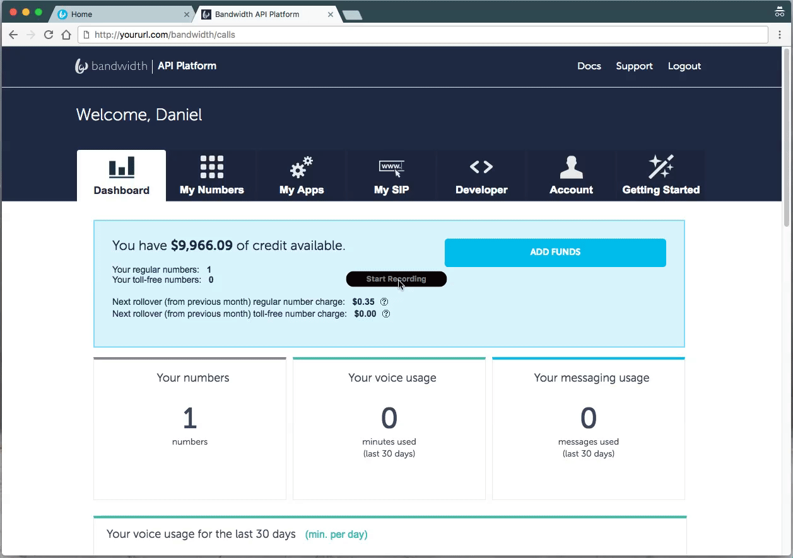

## Setup Bandwidth Application

### Using the UI

* Log into [your account](https://catapult.inetwork.com/pages/catapult.jsf)
* Navigate to the `My Apps` Tab
* Click The `Create New` Button in the left column.
* Set the application name to whatever you like
* Set the `HTTP` method to `POST`
* Set the `Application Type` to `BOTH`
* Set the `Messaging Callback` to `http://yoururl.com/bandwidth/messages`
* Set the `Voice Callback` to `http://yoururl.com/bandwidth/calls`
* Make sure `autoAnswer` is set to true



### Using the API

Either using the [API `POST` `/applications`](http://dev.bandwidth.com/howto/incomingCallandMessaging.html)

```http
POST https://api.catapult.inetwork.com/v1/users/{userId}/applications

{
	"incomingCallUrl"    : "http://yoururl.com/bandwidth/calls",
	"incomingMessageUrl" : "http://yoururl.com/bandwidth/messages",
	"callbackHttpMethod" : "POST",
	"autoAnswer"         : true
}
```

> Responds With

```http
201 success
Location: https://api.catapult.inetwork.com/v1/users/{{userId}}/applications/a-{{applicationId}}
```

### Save the `applicationId` to `BANDWIDTH_APPLICATION_ID` environment variable

